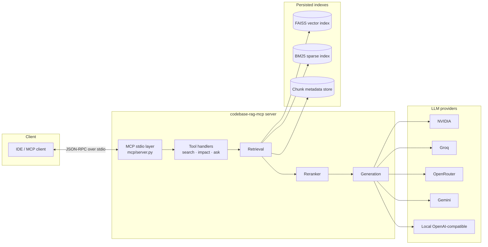
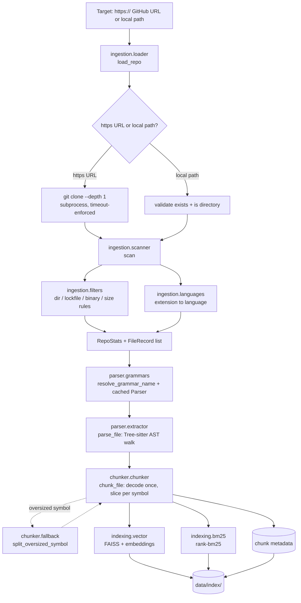
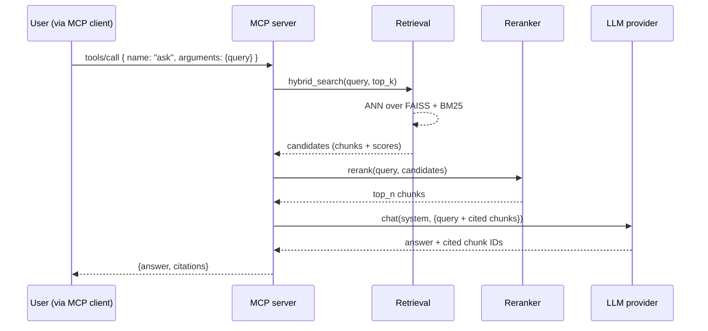
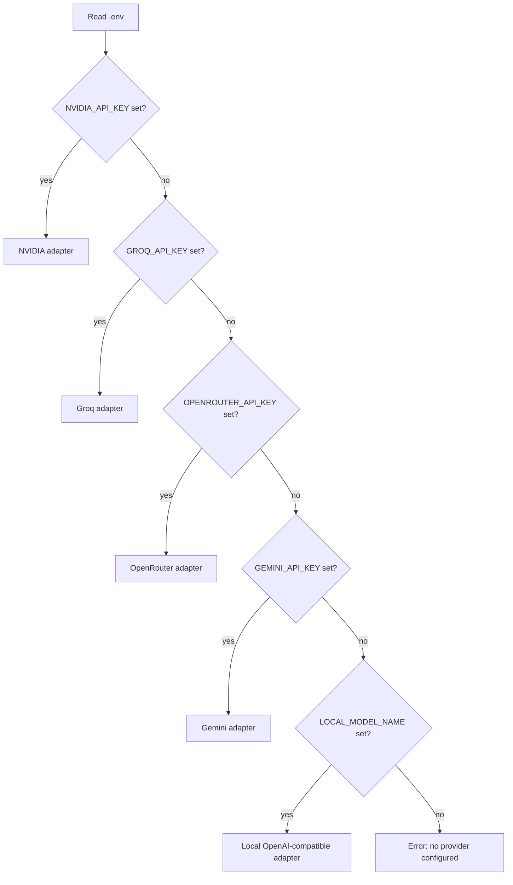

# FLOW

> End-to-end data flow for `codebase-rag-mcp`. Diagrams are intentionally
> Mermaid so they render in any Markdown viewer, GitHub, or VS Code.

---

## 1. Component map

---

## 2. Offline build flow

`codebase-rag index <path>` will walk the corpus once, persist indexes
to `INDEX_DIR`, and exit. Subsequent `codebase-rag serve` invocations
load the persisted indexes instead of rebuilding them.

Ingestion (`ingestion/loader.py` → `ingestion/filters.py` /
`ingestion/languages.py` → `ingestion/scanner.py`) accepts either an
`https://` GitHub URL — shallow-cloned via `subprocess` + the system
`git` into `DATA_DIR/clones/` — or a local directory path, then walks
the checkout applying ignore rules and extension-based language
detection to produce the `RepoStats` / `FileRecord` list consumed by
the parser stage below.

Parsing and chunking (`parser/extractor.py:parse_file` →
`chunker/chunker.py:chunk_file`, using `chunker/fallback.py:
split_oversized_symbol` for any symbol whose span exceeds
`DEFAULT_MAX_CHUNK_LINES`) each operate on **one file at a time** — given
a `FileRecord.path`/`language` and that file's raw bytes, `parse_file`
resolves a Tree-sitter grammar (`parser/grammars.py`, `.tsx` routed to
the `"tsx"` grammar even though ingestion reports it as `"typescript"`)
and hand-walks the AST into a `ParseResult` (functions/classes/methods/
interfaces with 1-indexed line ranges, qualified `ClassName.method`
names for nested symbols); `chunk_file` then decodes the file's bytes to
text exactly once and slices one `Chunk` per symbol (or a single
whole-file fallback `Chunk` if a file has none). **There is no
repo-wide orchestration here yet** — looping `parse_file`/`chunk_file`
over every `FileRecord` in a `RepoStats` and aggregating the resulting
chunks into one collection is Day 04's job (the embedding stage is the
first consumer that actually needs "all chunks for the repo" as a single
collection).

`parse_file`/`chunk_file` are exercised directly by
`tests/test_parser.py`/`tests/test_chunker.py` and a manual smoke test
today — the `E`/`F`/`G` boxes above (embedding, BM25, persisted indexes)
remain aspirational until Day 04/05 land the repo-wide loop that actually
calls them.

---

## 3. Online query flow (`ask` tool)

---

## 4. Provider selection

Selection order is configurable in a future iteration; the precedence
above keeps the most-specific provider keys first so an accidentally-
populated local block does not silently override a paid provider.

---

## 5. Data lifecycle

| Stage         | Lives where                            | Owner            |
| ------------- | -------------------------------------- | ---------------- |
| Raw source    | User's filesystem                      | User             |
| Parsed AST    | Memory only during ingest              | `parser/`        |
| Chunks        | Memory + serialized to `INDEX_DIR`     | `chunker/`       |
| Vector index  | `INDEX_DIR/*.faiss`                    | `indexing/vector.py` |
| BM25 index    | `INDEX_DIR/*.pkl`                      | `indexing/bm25.py`   |
| Logs          | stderr / `LOG_LEVEL`                   | `cli`, `mcp`     |
| Caches        | `.cache/`, `.mypy_cache/`, `.ruff_cache/` (gitignored) | tooling  |

Anything in `data/` or matching `*.faiss` / `*.index` is gitignored —
indexes are reproducible from source and should not be committed.
