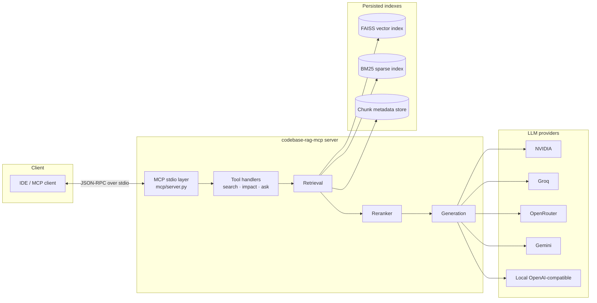
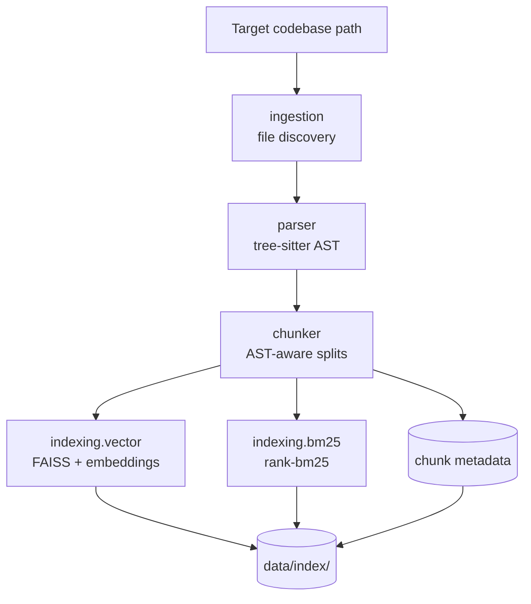
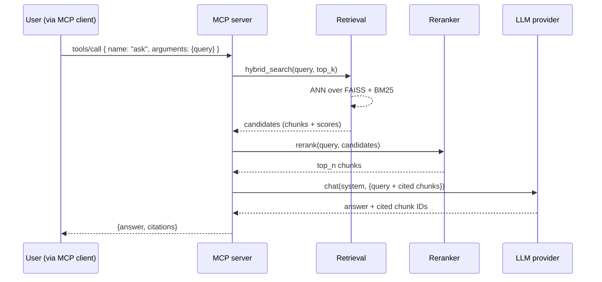
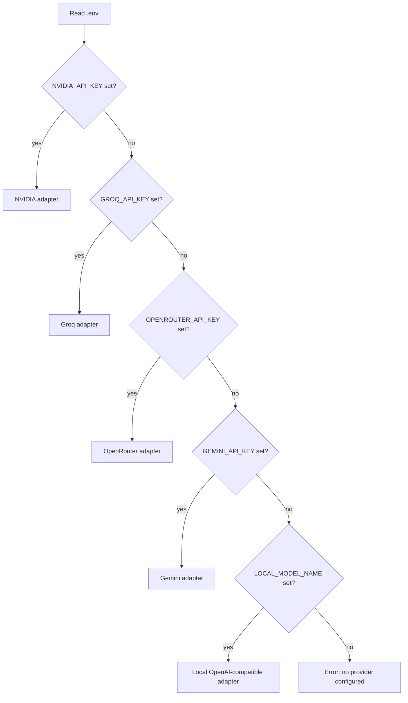

# FLOW

> End-to-end data flow for `codebase-rag-mcp`. Diagrams are intentionally
> Mermaid so they render in any Markdown viewer, GitHub, or VS Code.

---

## 1. Component map

---

## 2. Offline build flow

`codebase-rag index <path>` will walk the corpus once, persist indexes
to `INDEX_DIR`, and exit. Subsequent `codebase-rag serve` invocations
load the persisted indexes instead of rebuilding them.

---

## 3. Online query flow (`ask` tool)

---

## 4. Provider selection

Selection order is configurable in a future iteration; the precedence
above keeps the most-specific provider keys first so an accidentally-
populated local block does not silently override a paid provider.

---

## 5. Data lifecycle

| Stage         | Lives where                            | Owner            |
| ------------- | -------------------------------------- | ---------------- |
| Raw source    | User's filesystem                      | User             |
| Parsed AST    | Memory only during ingest              | `parser/`        |
| Chunks        | Memory + serialized to `INDEX_DIR`     | `chunker/`       |
| Vector index  | `INDEX_DIR/*.faiss`                    | `indexing/vector.py` |
| BM25 index    | `INDEX_DIR/*.pkl`                      | `indexing/bm25.py`   |
| Logs          | stderr / `LOG_LEVEL`                   | `cli`, `mcp`     |
| Caches        | `.cache/`, `.mypy_cache/`, `.ruff_cache/` (gitignored) | tooling  |

Anything in `data/` or matching `*.faiss` / `*.index` is gitignored —
indexes are reproducible from source and should not be committed.
