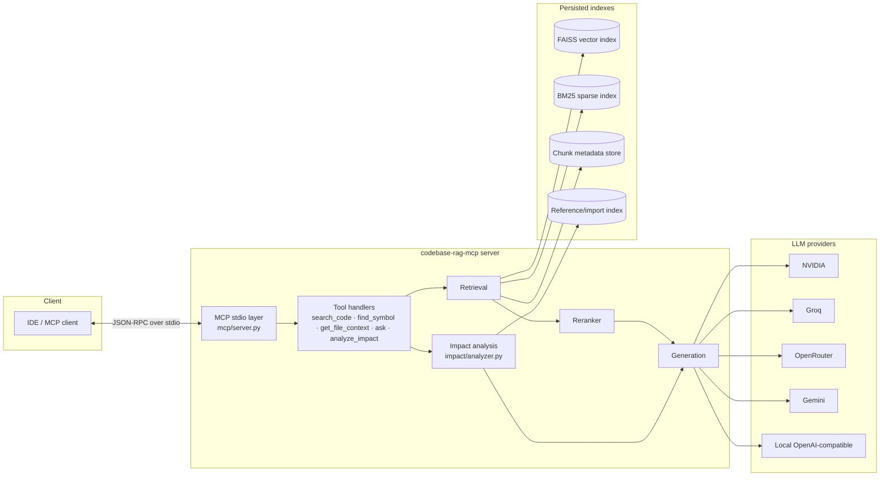
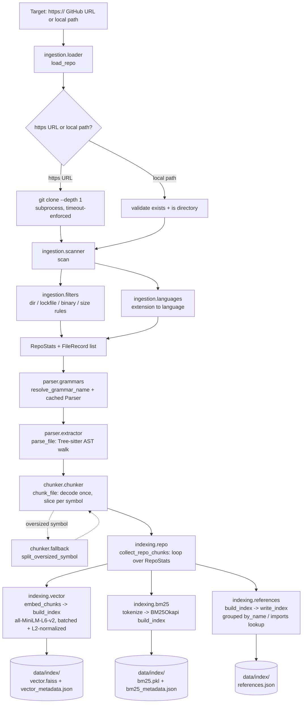
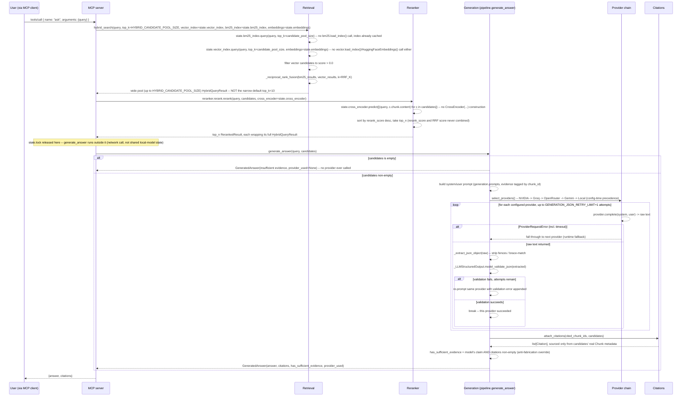
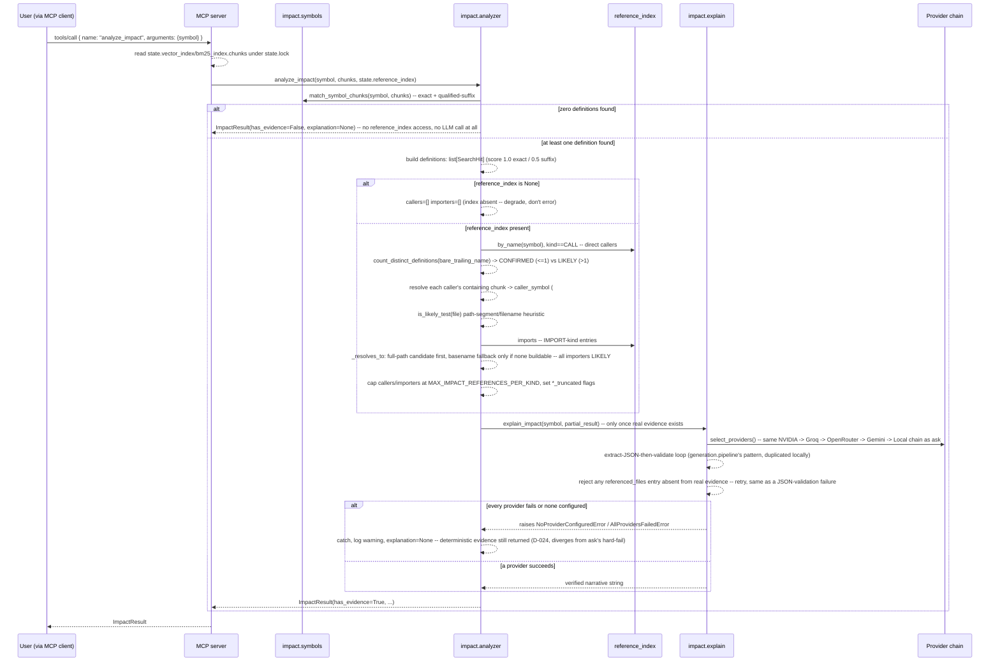
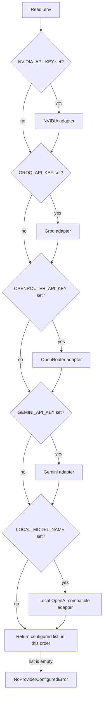
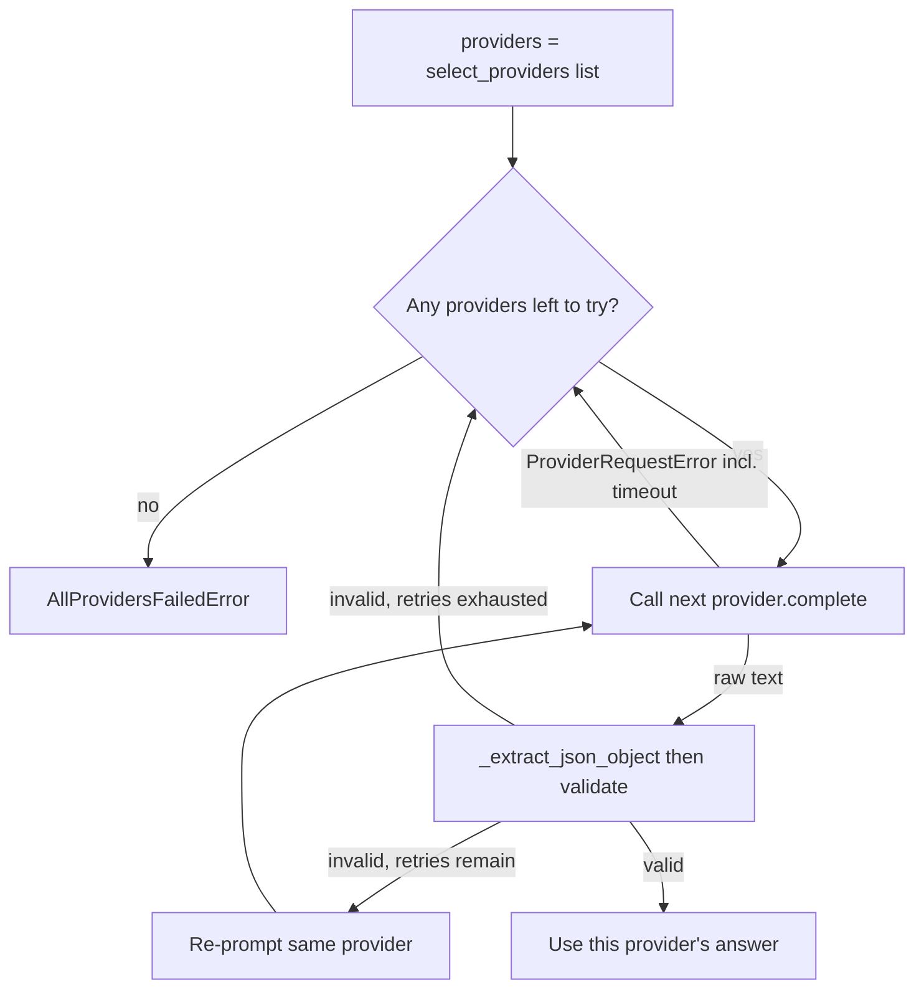

# FLOW

> End-to-end data flow for `codebase-rag-mcp`. Diagrams are intentionally
> Mermaid so they render in any Markdown viewer, GitHub, or VS Code.

---

## 1. Component map

---

## 2. Offline build flow

`codebase-rag index <path>` will walk the corpus once, persist indexes
to `INDEX_DIR`, and exit. Subsequent `codebase-rag serve` invocations
load the persisted indexes instead of rebuilding them.

Ingestion (`ingestion/loader.py` → `ingestion/filters.py` /
`ingestion/languages.py` → `ingestion/scanner.py`) accepts either an
`https://` GitHub URL — shallow-cloned via `subprocess` + the system
`git` into `DATA_DIR/clones/` — or a local directory path, then walks
the checkout applying ignore rules and extension-based language
detection to produce the `RepoStats` / `FileRecord` list consumed by
the parser stage below.

Parsing and chunking (`parser/extractor.py:parse_file` →
`chunker/chunker.py:chunk_file`, using `chunker/fallback.py:
split_oversized_symbol` for any symbol whose span exceeds
`DEFAULT_MAX_CHUNK_LINES`) each operate on **one file at a time** — given
a `FileRecord.path`/`language` and that file's raw bytes, `parse_file`
resolves a Tree-sitter grammar (`parser/grammars.py`, `.tsx` routed to
the `"tsx"` grammar even though ingestion reports it as `"typescript"`)
and hand-walks the AST into a `ParseResult` (functions/classes/methods/
interfaces with 1-indexed line ranges, qualified `ClassName.method`
names for nested symbols); `chunk_file` then decodes the file's bytes to
text exactly once and slices one `Chunk` per symbol (or a single
whole-file fallback `Chunk` if a file has none).

Repo-wide orchestration (`indexing/repo.py:collect_repo_chunks`) is the
first place `parse_file`/`chunk_file` get looped over an entire
`RepoStats`: for every `included=True` `FileRecord`, it reads
`root / file.path`, calls `parse_file` (with the repo-relative, not
physical, path -- see D-018) then `chunk_file`, and aggregates every
file's chunks into one `list[Chunk]` for the whole repo. A file that
can't be read (`OSError`), or whose language has no configured
Tree-sitter grammar yet (`UnsupportedLanguageError`) or that Tree-sitter
can't parse at all (`ParseError`), is recorded into
`RepoChunkCollection.read_failures` (path + reason) rather than aborting
the run -- see D-018 for why the language/parse-error case matters in
practice (most real repos have at least a README.md, which has no
grammar configured today).

Embedding (`indexing/vector.py:embed_chunks` → `embed_texts` →
`build_index`) takes that aggregated `list[Chunk]`, filters out any
chunk with empty/whitespace-only `content` (recorded as a `SkippedChunk`,
never silently dropped), and embeds the rest locally via
`langchain_huggingface.HuggingFaceEmbeddings` (`all-MiniLM-L6-v2` by
default, see `config.EMBEDDING_MODEL_NAME`/`EMBEDDING_BATCH_SIZE`) in a
single batched call per `embed_texts` invocation (D-017). Every resulting
vector is L2-normalized in one place (`_l2_normalize`) so the persisted
FAISS `IndexFlatIP` (D-015/D-016) performs a correct cosine-similarity
search — the same normalization path is reused at query time
(`VectorIndex.query`) so build-side and query-side vectors are always
comparable.

BM25 indexing (`indexing/bm25.py:build_index`) takes the same aggregated
`list[Chunk]` — via `indexing/repo.py:build_all_indexes`, which calls
`collect_repo_chunks` exactly once and hands the identical chunk list to
both `vector.build_index` and `bm25.build_index`, so the two indexes always
share the same chunk set and `Chunk.id` values (D-020). Chunks are
tokenized (lowercase, split on non-alphanumeric runs — one shared
`tokenize` function, reused at query time) into a `rank_bm25.BM25Okapi`
corpus and persisted as a pickle (`bm25.pkl`, since `BM25Okapi` has no
native serialization) alongside a JSON chunk-metadata sidecar
(`bm25_metadata.json`), mirroring the vector index's binary+JSON split.

Reference indexing (`indexing/references.py:build_index`/`write_index`,
Day 10) is a parallel, sibling path fed by the *same* per-file
`parser.extractor.parse_file` call `collect_repo_chunks` already makes —
`parse_file` now also runs a second, full-tree Tree-sitter walk (opposite
recursion policy from the symbol walk: it descends into every function/
method body, since that's where calls happen) to produce
`ParseResult.references: list[RawReference]` (call sites + import
statements), which `collect_repo_chunks` tags with the originating file
into `RepoChunkCollection.references: list[FileReference]` alongside
`.chunks`. `indexing.repo.build_all_indexes` then groups that list into a
`ReferenceIndex` (a plain in-memory lookup, not a model — `by_name` for
call-site lookup, `imports` for import-statement lookup) and persists it
as plain JSON (`references.json`, no pickle needed) — no re-walk of the
repo, since `collect_repo_chunks` already produced everything needed in
its one pass.

`parse_file`/`chunk_file` are exercised directly by
`tests/test_parser.py`/`tests/test_chunker.py`. `indexing.repo.collect_repo_chunks`
(`D3`) and `indexing.vector` (`E`/`G`) are implemented and tested as of
Day 04 (`tests/test_indexing_repo.py`, `tests/test_indexing_vector.py`) —
a fresh process can `load_index(index_dir=...)` against `G` and query it
with no rebuild. `F`/`H` (BM25) are implemented and tested as of Day 05
(`tests/test_indexing_bm25.py`), reached via
`indexing.repo.build_all_indexes` which calls `collect_repo_chunks` exactly
once and builds `E` and `F` from the identical chunk list (D-020). `I`/`J`
(the reference/import index) are implemented and tested as of Day 10
(`tests/test_indexing_references.py`), reached via the same
`build_all_indexes` call — `references.json`'s absence is lenient (a
fresh `ReferenceIndex | None` load returns `None`, not an error; see
D-024), unlike `E`/`G` and `F`/`H`'s strict "must be built first" contract.

---

## 3. Online query flow

The MCP server (`mcp/server.py`, Day 08 + Day 10's `analyze_impact`) owns
five tools. `search_code`, `find_symbol`, and `get_file_context` return
raw evidence; `ask` calls `generate_answer`; `analyze_impact` calls
`impact.analyzer.analyze_impact`, which itself may call `generate_answer`'s
sibling `impact.explain.explain_impact`. All five read cached state
(`vector_index`, `bm25_index`, one `CrossEncoder`, one embedding-model
instance, and — Day 10 — an optional `reference_index`) loaded/constructed
exactly once at server startup via `lifespan` — see D-023/D-024 — never
reconstructed per call, and never touched without holding
`_ServerState.lock` for the calls that actually use it
(`hybrid_search`/`rerank`, and `analyze_impact`'s own `.chunks` read).
`reference_index` is the one piece of that cached state loaded leniently —
its absence (or corruption, logged at startup) never blocks the server
from starting, unlike `vector_index`+`bm25_index` both being absent.

**`ask` tool:**

`retrieval.hybrid.hybrid_search` (Day 05, `tests/test_retrieval_hybrid.py`)
loads both indexes fresh each call *unless* a caller passes already-loaded
`vector_index`/`bm25_index`/`embeddings` instances (Day 08's additive
caching parameters, D-023) — `mcp/server.py` is the first real caller to do
so, using its startup-cached instances so no per-query `load_index`/
`HuggingFaceEmbeddings()` call (and the network round-trip the latter was
found to trigger) ever happens. Raises `NoIndexAvailableError` only if
*neither* index is available (given or loadable); a query against two
built indexes that matches nothing returns `[]` rather than raising, so a
downstream "not enough evidence" fallback (Day 07) can tell "nothing
indexed" apart from "indexed, no evidence for this query."

`reranker.rerank.rerank` (Day 06, `tests/test_reranker.py`) consumes
`hybrid_search`'s output as-is — it never re-embeds, re-tokenizes, or
re-fetches chunk content, only reorders the `HybridQueryResult`s it is
given. **Callers must pass `top_k=HYBRID_CANDIDATE_POOL_SIZE` into
`hybrid_search` before reranking** — the default `top_k=10` truncates the
merged pool before the reranker ever sees it, defeating the point of this
stage; this is the explicit interface contract between Day 05 and Day 06
(see DECISIONS.md D-021), now honored by `mcp/server.py`'s `search_code`/
`ask` implementations, its first real production callers. `rerank_score`
(a raw cross-encoder logit) and the RRF `score` on the wrapped
`HybridQueryResult` are never combined into a single number — only
`rerank_score` determines the reordered output. `rerank` also accepts a
pre-built `cross_encoder` (Day 08's additive parameter) to skip its own
~9.7-9.9 s construction cost (D-021) per call — `mcp/server.py` constructs
one at startup and reuses it for every tool call in the process's lifetime.

`generation.pipeline.generate_answer` (Day 07, `tests/test_generation.py`)
is the last non-MCP stage. Day 08's `ask` tool calls into this rather than
adding new generation logic of its own (D-022's flagged gap -- no V1
contract tool exposed a generated answer -- is resolved by adding `ask`,
see D-023). It never
calls a provider when `candidates` is empty — zero evidence means zero
tokens spent. Otherwise it builds a strict evidence-only prompt
(`generation.prompts`, each candidate tagged by `chunk_id`) and iterates
`generation.providers.registry.select_providers()`'s configured chain with
**runtime** fallback-on-failure — a `ProviderRequestError` (including a
timeout) or an exhausted `GENERATION_JSON_RETRY_LIMIT` moves to the next
provider; only once every configured provider has failed does
`AllProvidersFailedError` raise, distinct from `NoProviderConfiguredError`
(raised earlier, at `select_providers()`, when nothing was ever a
candidate). A provider's raw text is never trusted directly: it passes
through `_extract_json_object` (defends against code-fence-wrapped or
prose-prefixed JSON, a common free-tier model failure mode) before
`_LLMStructuredOutput.model_validate_json(...)` validates it. The model
only ever supplies `cited_chunk_ids` — `citations.attach.attach_citations`
maps those back to real `Chunk` metadata from `candidates`, silently
dropping any ID absent from the given candidate pool, and a citation list
that comes back empty forces `has_sufficient_evidence=False` regardless of
what the model claimed. See DECISIONS.md D-022 for the full design
rationale, including the confirmed free-tier model per provider and the
named, only-partially-mitigated prompt-injection risk.

**`search_code`, `find_symbol`, `get_file_context` tools (Day 08,
`tests/test_mcp_server.py`)** — none of these three call `generate_answer`;
they return raw evidence only:
- `search_code(query, top_k)`: `hybrid_search` (wide pool, cached indexes)
  → `rerank` (cached `CrossEncoder`, `top_n=top_k`) → flatten each
  `RerankedResult` into a `SearchHit` (file/symbol/line/content/score).
- `find_symbol(symbol)`: reads the cached index's `.chunks` directly (no
  retrieval/reranking at all) and does an exact-or-qualified-suffix match
  on `chunk.symbol` (D-013's `ClassName.method` naming) — `score=1.0`
  exact, `score=0.5` suffix, a match-quality indicator, not a retrieval
  score. Definitions only; see `analyze_impact` below for usages/callers.
  Zero matches is a normal empty result, never an error. This matching
  logic (Day 10) now lives in the shared `impact.symbols.match_symbol_chunks`,
  with `_match_symbol` reduced to a thin `Chunk`→`SearchHit` wrapper
  around it (D-024) — `find_symbol` and `analyze_impact` share exactly
  one implementation.
- `get_file_context(file, start_line, end_line)`: resolves `file` against
  the per-index manifest's `repo_root` (`indexing.manifest`, D-023),
  verifies containment (mirrors `ingestion.scanner.scan`'s resolve-then-
  `relative_to` discipline, raising instead of excluding), and reads the
  exact requested line range directly from disk — never reconstructed from
  indexed chunk content. Works for any real file under `repo_root`, not
  only indexed ones (a named V1 limitation, see D-023).

**`analyze_impact` tool (Day 10, `tests/test_mcp_server.py`,
`tests/test_impact.py`):**

Unlike `search_code`/`ask`, only the `chunks` read happens under
`state.lock` — the deterministic-evidence assembly and the LLM call both
run outside it, mirroring `ask`'s own `generate_answer` call (a network
call must never block `search_code`/`find_symbol`). See D-024 for the
full design rationale, including the empirically-verified Tree-sitter
node types the reference scanner relies on and the real false-positive
bug (a `.js`-extensioned relative TS import) found and fixed during this
day's own manual verification against the real `p-queue` demo repo.

---

## 4. Provider selection

This section has two distinct mechanisms, kept deliberately separate (see
DECISIONS.md D-022): **config-time precedence** (which providers are even
candidates, decided once per call from `.env`) and **runtime
fallback-on-failure** (which candidate's failure moves to the next,
decided while `generate_answer` is actually running). Confusing the two
would hide the difference between "nothing was ever configured"
(`NoProviderConfiguredError`) and "candidates existed but every one failed"
(`AllProvidersFailedError`).

**Config-time precedence** — `generation.providers.registry.select_providers`:

The precedence above keeps the most-specific provider keys first so an
accidentally-populated local block does not silently override a paid
provider. This selection is purely additive/ordering — it never inspects
whether a provider will actually succeed.

**Runtime fallback-on-failure** — `generation.pipeline.generate_answer`,
consuming the ordered list above:

A provider is retried in place (same provider, corrected prompt) up to
`GENERATION_JSON_RETRY_LIMIT` times for a JSON-validation failure only —
a `ProviderRequestError` is never retried, it moves straight to the next
configured provider.

---

## 5. Data lifecycle

| Stage         | Lives where                            | Owner            |
| ------------- | -------------------------------------- | ---------------- |
| Raw source    | User's filesystem                      | User             |
| Parsed AST    | Memory only during ingest              | `parser/`        |
| Chunks        | Memory only (aggregated by `indexing.repo.collect_repo_chunks`) | `chunker/`, `indexing/repo.py` |
| Vector index  | `INDEX_DIR/vector.faiss` + `INDEX_DIR/vector_metadata.json` | `indexing/vector.py` |
| BM25 index    | `INDEX_DIR/bm25.pkl` + `INDEX_DIR/bm25_metadata.json` | `indexing/bm25.py`   |
| Reference index | `INDEX_DIR/references.json` (plain JSON, absence is lenient) | `indexing/references.py` |
| Manifest      | `INDEX_DIR/manifest.json` (repo_root, source)          | `indexing/manifest.py` |
| Logs          | stderr / `LOG_LEVEL`                   | `cli`, `mcp`     |
| Caches        | `.cache/`, `.mypy_cache/`, `.ruff_cache/` (gitignored) | tooling  |

Anything in `data/` or matching `*.faiss` / `*.index` is gitignored —
indexes are reproducible from source and should not be committed.
